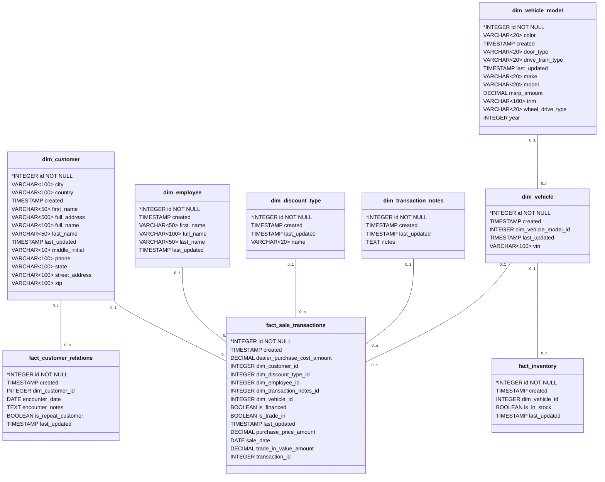

```mermaid
classDiagram
class fact_inventory{
   *INTEGER id NOT NULL
   TIMESTAMP created
   INTEGER dim_vehicle_id
   BOOLEAN is_in_stock
   TIMESTAMP last_updated
}
class fact_sale_transactions{
   *INTEGER id NOT NULL
   TIMESTAMP created
   DECIMAL dealer_purchase_cost_amount
   INTEGER dim_customer_id
   INTEGER dim_discount_type_id
   INTEGER dim_employee_id
   INTEGER dim_transaction_notes_id
   INTEGER dim_vehicle_id
   BOOLEAN is_financed
   BOOLEAN is_trade_in
   TIMESTAMP last_updated
   DECIMAL purchase_price_amount
   DATE sale_date
   DECIMAL trade_in_value_amount
   INTEGER transaction_id
}
class fact_customer_relations{
   *INTEGER id NOT NULL
   TIMESTAMP created
   INTEGER dim_customer_id
   DATE encounter_date
   TEXT encounter_notes
   BOOLEAN is_repeat_customer
   TIMESTAMP last_updated
}
class dim_customer{
   *INTEGER id NOT NULL
   VARCHAR<100> city
   VARCHAR<100> country
   TIMESTAMP created
   VARCHAR<50> first_name
   VARCHAR<500> full_address
   VARCHAR<100> full_name
   VARCHAR<50> last_name
   TIMESTAMP last_updated
   VARCHAR<10> middle_initial
   VARCHAR<100> phone
   VARCHAR<100> state
   VARCHAR<100> street_address
   VARCHAR<100> zip
}
class dim_employee{
   *INTEGER id NOT NULL
   TIMESTAMP created
   VARCHAR<50> first_name
   VARCHAR<100> full_name
   VARCHAR<50> last_name
   TIMESTAMP last_updated
}
class dim_discount_type{
   *INTEGER id NOT NULL
   TIMESTAMP created
   TIMESTAMP last_updated
   VARCHAR<20> name
}
class dim_vehicle{
   *INTEGER id NOT NULL
   TIMESTAMP created
   INTEGER dim_vehicle_model_id
   TIMESTAMP last_updated
   VARCHAR<100> vin
}
class dim_vehicle_model{
   *INTEGER id NOT NULL
   VARCHAR<20> color
   TIMESTAMP created
   VARCHAR<20> door_type
   VARCHAR<20> drive_train_type
   TIMESTAMP last_updated
   VARCHAR<20> make
   VARCHAR<20> model
   DECIMAL msrp_amount
   VARCHAR<100> trim
   VARCHAR<20> wheel_drive_type
   INTEGER year
}
class dim_transaction_notes{
   *INTEGER id NOT NULL
   TIMESTAMP created
   TIMESTAMP last_updated
   TEXT notes
}
dim_vehicle "0..1" -- "0..n" fact_inventory
dim_customer "0..1" -- "0..n" fact_sale_transactions
dim_employee "0..1" -- "0..n" fact_sale_transactions
dim_discount_type "0..1" -- "0..n" fact_sale_transactions
dim_transaction_notes "0..1" -- "0..n" fact_sale_transactions
dim_vehicle "0..1" -- "0..n" fact_sale_transactions
dim_customer "0..1" -- "0..n" fact_customer_relations
dim_vehicle_model "0..1" -- "0..n" dim_vehicle
```